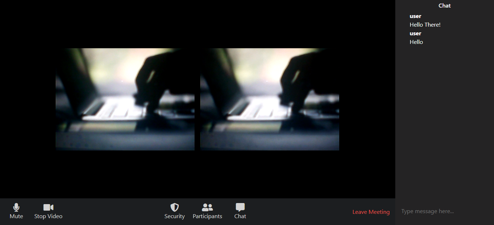

# ZOOM CLONE

Zoom Clone using Nodejs, Express server, Peerjs Library, Socket.io, ejs and UUID. Deployed it on [heroku](https://www.heroku.com/)

## To use the Zoom clone with your friends :

- click on Live Demo Link below or [Click Here](https://nameless-inlet-35193.herokuapp.com/) This will run the zoom clone
- now after when you see the web app is runnig you will see the the URL with unique ID e.g (https://nameless-inlet-35193.herokuapp.com/dd3fb1d1-6***-****-b***-**********de%20)
- you don't need to worry about unique Id it's auto generated when you click on Live demo link
- After then you need to copy that entire URL and send it to your friend who wants to join you.
- wait for few second if it takes long just refresh the page and you will be able to see him/her on your screen.

Some of the Features:

1. Live Video call
2. Real Time messaging
3. mute button to turn off the audio
4. play Button to turn on/off the Video

## Built With

- ReactJs
- NodeJs
- Express Server
- Peerjs Library
- Socket.io
- ejs
- HTML & CSS

## Live Demo

[Live Demo Link](https://nameless-inlet-35193.herokuapp.com/)

## Getting Started

To get local copy up and running in your local machine follow this simple step:

## Install

To install some of the required packages in your local machine

- clone the repository
- in your terminal type `yarn install`

## Run Test

`yarn start`

## Author

:bust_in_silhouette: **Author1**

- GitHub: [@Div685](https://github.com/Div685)
- Twitter: [@div_685](https://twitter.com/div_685)
- LinkedIn: [Divyesh Patel](https://www.linkedin.com/in/divyesh-patel-2a15a6107)

## :handshake: Contributing

Contributions, issues, and feature requests are welcome!

Feel free to check the [issues page](https://github.com/Div685/Zoom-Clone/issues/).

## Show your support

Give a :star: if you like this project

## Acknowledgments

- [Heroku](https://www.heroku.com/)

## License

This page is [MIT](LICENSE/) licence
